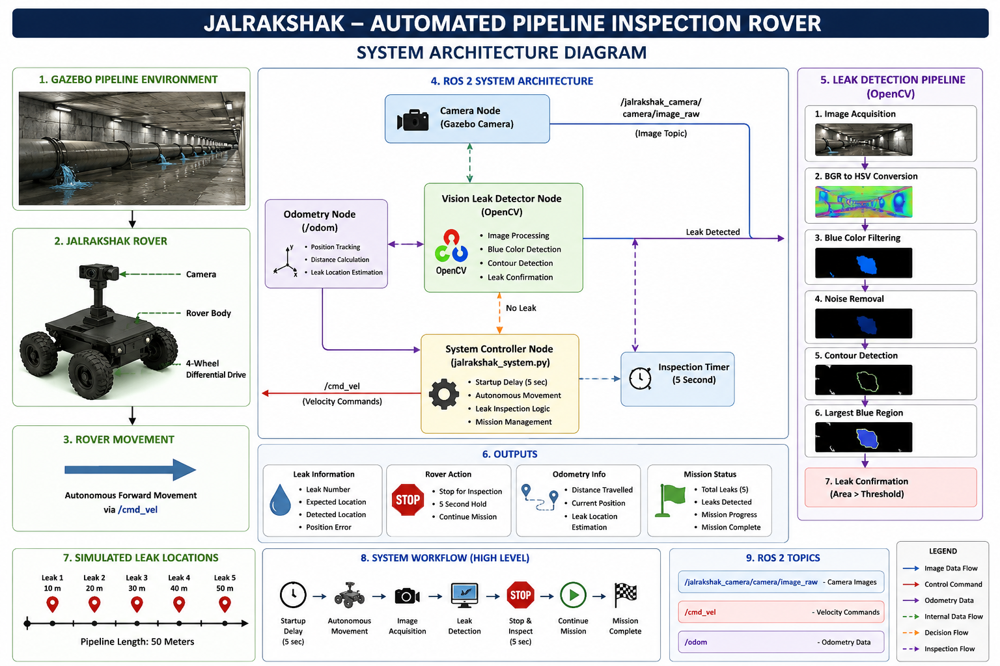

# 🚰 JalRakshak – Automated Pipeline Inspection Rover

JalRakshak is a ROS 2 and Gazebo-based automated pipeline inspection rover simulation designed to detect simulated water leakages inside underground pipeline environments.

The system combines a four-wheel differential-drive rover, onboard camera, OpenCV-based vision processing, odometry tracking, and autonomous movement to identify and locate simulated water leaks.

---

## 🎯 Project Objective

The main objective of JalRakshak is to develop a robotic pipeline inspection system that can:

- Inspect underground water pipelines
- Detect simulated water leakage automatically
- Estimate the approximate leak location
- Stop the rover when a leak is detected
- Perform a short inspection
- Continue the inspection after the leak
- Track the rover's travelled distance
- Calculate leak position error
- Complete inspection of multiple leak points

The long-term goal is to reduce manual inspection effort, inspection time, and water wastage.

---

## ⚙️ Technologies Used

- ROS 2 Humble
- Gazebo
- Python
- OpenCV
- NumPy
- CvBridge
- URDF
- Differential Drive
- Odometry
- Linux / Ubuntu

---

## 🤖 Rover Features

- 4-wheel rover configuration
- Differential-drive movement
- Autonomous forward movement
- Onboard camera
- ROS 2 camera integration
- OpenCV-based leak detection
- Blue-region water leak simulation
- Odometry-based distance tracking
- Multiple leak detection
- Automatic rover stopping
- Automatic inspection delay
- Leak location estimation
- Expected vs detected location comparison
- Position error calculation
- Mission completion detection

---

## 🏗️ System Architecture

The JalRakshak system integrates the Gazebo pipeline environment, ROS 2 communication, autonomous rover control, camera-based vision processing, OpenCV leak detection, and odometry-based location tracking.



---

## 💧 Leak Detection System

The rover-mounted camera continuously publishes images through ROS 2.

The vision processing system receives the camera images and uses OpenCV to identify blue-colored regions representing simulated water leakage.

### Detection Pipeline

```text
Camera Image
     ↓
ROS 2 Image Topic
     ↓
CvBridge
     ↓
OpenCV Image Processing
     ↓
BGR → HSV Conversion
     ↓
Blue Color Filtering
     ↓
Noise Removal
     ↓
Contour Detection
     ↓
Largest Blue Region
     ↓
Area Threshold
     ↓
Water Leak Confirmed
